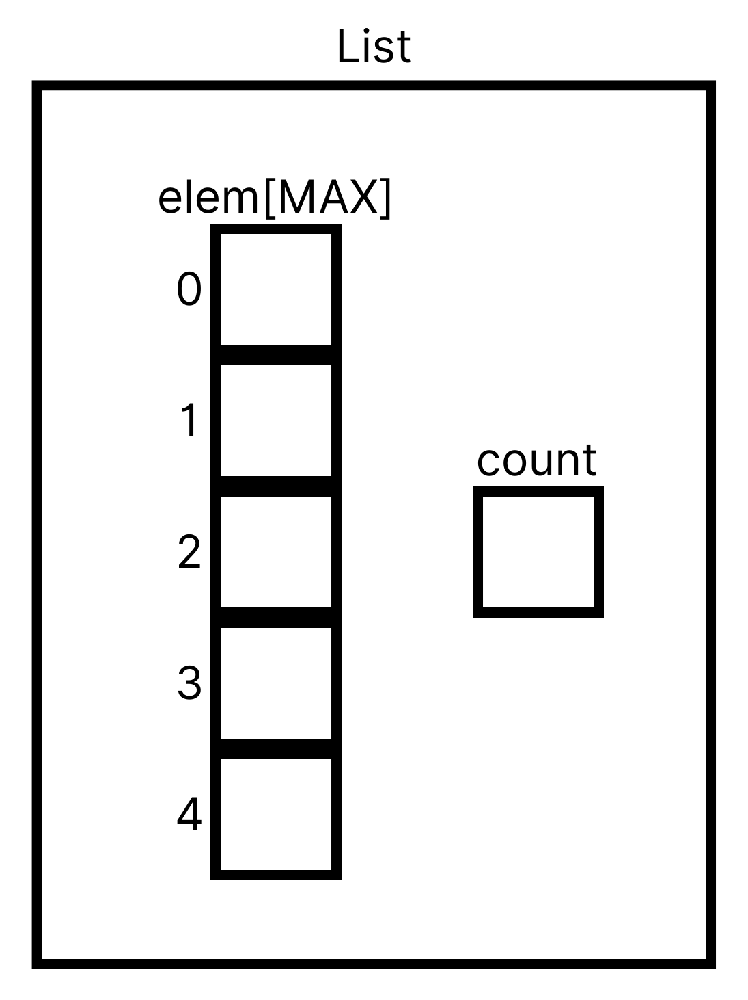

###### Array Definition
```c
#define MAX 3

typedef struct {
	int elem[MAX];
	int count;
} List;
```

###### Diagram


###### Functions
1. `initList()` - initializes the list to be empty
2. `insertLast()` - inserts an element at the last position in the list
3. `insertLastUnique()` - inserts an element at the last position if it is unique
4. `deleteElem()` - deletes a given element if it exists in the list
5. `deleteAllOccur()` - deletes all occurrences of an element in the list
6. `insertSorted()` - (assuming the list is sorted) inserts an element in the appropriate position in the list

###### Complete Code
```c
#include <stdio.h>
#include <stdlib.h>

#define MAX 3

typedef struct {
	int elem[MAX];
	int count;
} List;

void initList(List *A);
void insertLast(List *A, int val);
void insertLastUnique(List *A, int val);
void deleteElem(List *A, int val);
void deleteAllOccur(List *A, int val);
void insertSorted(List *A, int val);
void printer(List A);

int main(void){
  List A;
  initList(&A);
  insertLast(&A, 1);
  insertLast(&A, 2);
  insertLast(&A, 4);
  printer(A);
  insertSorted(&A, 3);
  printer(A);
  return 0;
}

void initList(List *A){
  A->count = 0;
}

void printer(List A){
  int i;
  for(i = 0; i < A.count; i++) printf("%d. [%d]\n", i+1, A.elem[i]);
  printf("\n");
}

void insertLast(List *A, int val){
  if(A->count < MAX){
    A->elem[A->count++] = val;
  }
  else {
    printf("FULL!\n");
  }
}

void insertLastUnique(List *A, int val){
  if(A->count < MAX){
    int i;
    for(i = 0; i < A->count && A->elem[i] != val; i++);
    if(i == A->count){
      A->elem[A->count++] = val;
    }
    else {
      printf("NOT UNIQUE!\n");
    }
  }
}

void deleteElem(List *A, int val){
  int i;
  for(i = 0; i < A->count && A->elem[i] != val; i++);
  if(i != A->count){
    A->count--;
    for(; i < A->count; i++){
      A->elem[i] = A->elem[i+1]; 
    }
  }
}

void deleteAllOccur(List *A, int val){
  int i, j;
  for(i = 0; i < A->count; ){
    if(A->elem[i] == val){
      A->count--;
      for(j = i; j < A->count; j++){
        A->elem[j] = A->elem[j+1];
      }
    }
    else {
      i++;
    }
  }
}

void insertSorted(List *A, int val){
  if(A->count < MAX){
    int i;
    for(i = 0; i < A->count && A->elem[i] < val; i++){}
    for(int j = i; j < A->count; j++){
      A->elem[j+1] = A->elem[j];
    }
    A->count++;
    A->elem[i] = val;
  }
  else printf("FULL!\n");
}
```
